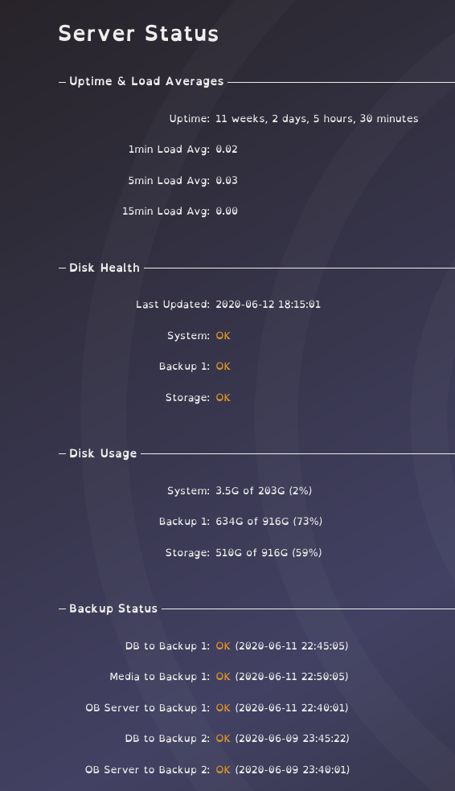

 

# Server Status
{:.no_toc}

* TOC
{:toc}

{: .server status}

Shows server uptime, load, S.M.A.R.T status, and backup status

initial configuration

copy config.sample.php to config.php

## Smart Status Configuration

install smartmontools package    

(optional) set up smartd to ensure adequate monitoring and email notifications: https://www.howtoforge.com/checking-hard-disk-sanity-with-smartmontools-debian-ubuntu

specify drives for smart status in config.php ($config['smart']).

run tools/smart.php once an hour (crontab as root) to update status displayed on ob server.  

## Disk Usage Configuration

specify drives for disk usage in config.php ($config['usage']).

## Backup Command Configuration

specify backup descriptions and commands in config.php ($config['backup']).

run commands tools/backup.php COMMAND_INDEX on appropriate schequle (crontab as root).
